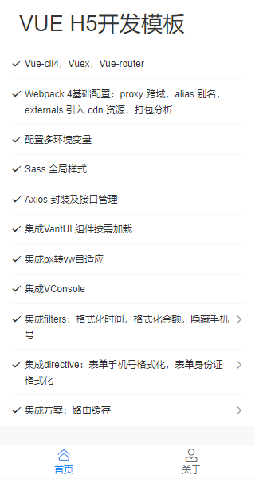

# 移动端H5模板

基于
[vue-cli4.0 + webpack 4 + vant ui + sass+ vw 适配方案+axios 封装，构建手机端]模板脚手架


### 首页



### 启动项目

```bash

npm install

npm run dev
```

<span id="top">目录</span>

```
./src/

├── api // 存放 api 接口
├── assets // 存放静态资源
├── components // 自定义组件
├── config // 不同环境配置项
├── directive // 自定义指令（可空）
├── filters // 自定义过滤器（可空）
├── plugins // 第三方插件（vant）
├── router // 页面路由配置
├── store // vuex
├── utils // 工具库
└── views // 页面
```

### <span id="env">✅ 配置多环境变量 </span>

`package.json` 里的 `scripts` 配置 `serve` `stage` `build`，通过 `--mode xxx` 来执行不同环境

- 通过 `npm run dev` 启动本地 , 执行 `development`
- 通过 `npm run stage` 打包测试 , 执行 `staging`
- 通过 `npm run build` 打包正式 , 执行 `production`

```javascript
"scripts": {
  "dev": "vue-cli-service serve --open",
  "stage": "vue-cli-service build --mode staging",
  "build": "vue-cli-service build",
}
```

### <span id="vw">✅ vm 适配方案 </span>

.postcssrc.js 自动将 px 转换 vw

```javascript
// https://github.com/michael-ciniawsky/postcss-load-config
module.exports = {
  plugins: {
    autoprefixer: {
      overrideBrowserslist: ['Android 4.1', 'iOS 7.1', 'Chrome > 31', 'ff > 31', 'ie >= 8']
    },
    'postcss-px-to-viewport': {
      viewportWidth: 375, // 视窗的宽度，对应的是我们设计稿的宽度，一般是750
      unitPrecision: 3, // 指定`px`转换为视窗单位值的小数位数（很多时候无法整除）
      viewportUnit: 'vw', // 指定需要转换成的视窗单位，建议使用vw
      selectorBlackList: ['.ignore', '.hairlines'], // 指定不转换为视窗单位的类，可以自定义，可以无限添加,建议定义一至两个通用的类名
      minPixelValue: 1, // 小于或等于`1px`不转换为视窗单位，你也可以设置为你想要的值
      mediaQuery: false // 允许在媒体查询中转换`px`
    }
  }
}
```

### <span id="vw">✅ vant </span>

#### reset.scss 中重置 vant 样式

### <span id="vw">✅ 组件缓存 </span>

利用 vuex 控制页面组件缓存

（1）路由缓存控制

```
<keep-alive :include="catchList">
    <router-view></router-view>
</keep-alive>
...
computed: {
  catchList: function() {
    return this.$store.state.app.catchList
  }
}
```

(2)进入缓存页面配置缓存

```
router.beforeEach((to, from, next) => {
  ...

  if (to.name === 'TaskCenter') {
    store.dispatch('app/keepAlive', to.name);
  }
  next();
});
```

(3)离开页面清除缓存

```
beforeRouteLeave(to, from, next) {
    if (to.name !== 'TaskDetail') {
      this.$store.dispatch('app/noKeepAlive', 'TaskCenter');
    }
    next();
  },
```


### <span id="vw">✅ 设计还原 </span>

1px 谷歌插件自测


